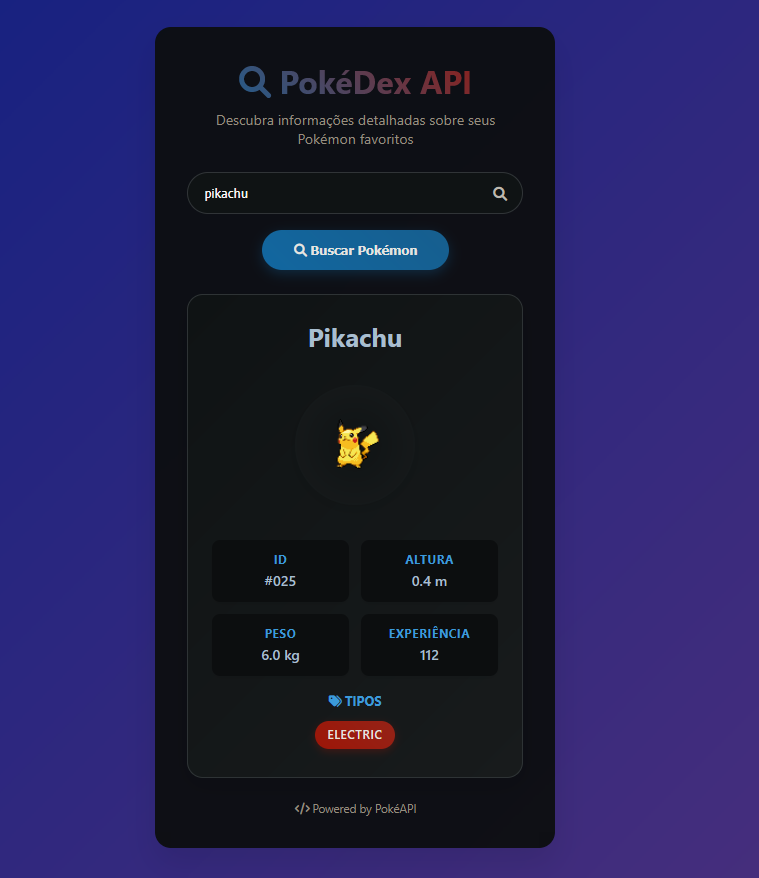

# 🔍 PokéDex API

<div align="center">


**Uma aplicação web moderna e elegante para buscar informações detalhadas sobre Pokémon**

[🖼️ Preview](#-preview) • [📋 Funcionalidades](#-funcionalidades) • [🚀 Como Executar](#-como-executar) • [🛠️ Tecnologias](#️-tecnologias)

</div>

---

## 🖼️ Preview

<div align="center">

### 🎨 **Interface Principal**


*Design moderno com gradientes, animações suaves e layout responsivo*

</div>

---

## 📖 Sobre o Projeto

A **PokéDex API** é uma aplicação web que permite aos usuários buscar informações completas sobre qualquer Pokémon. Com um design moderno e responsivo, a aplicação oferece uma interface intuitiva e profissional para explorar o mundo Pokémon.

O projeto utiliza a [PokéAPI](https://pokeapi.co/) como fonte de dados e implementa um backend em Node.js para gerenciar as requisições, garantindo melhor performance e controle sobre as consultas.

## ✨ Funcionalidades

### 🎯 **Funcionalidades Principais**
- 🔍 **Busca por Nome**: Digite o nome de qualquer Pokémon
- 📊 **Informações Detalhadas**: ID, altura, peso, experiência base
- 🏷️ **Tipos do Pokémon**: Exibidos como badges coloridas elegantes
- 🖼️ **Imagem Oficial**: Sprite frontal oficial do Pokémon
- ⚡ **Busca Rápida**: Pressione Enter para buscar instantaneamente

### 🎨 **Experiência do Usuário**
- 📱 **Design Responsivo**: Funciona perfeitamente em mobile e desktop
- 🌟 **Animações Suaves**: Transições elegantes e efeitos visuais
- ⏳ **Loading States**: Indicador visual durante o carregamento
- ❌ **Tratamento de Erros**: Mensagens de erro amigáveis
- 🎭 **Interface Moderna**: Design glassmorphism com gradientes

## 🛠️ Tecnologias

### **Frontend**
-  **HTML5** - Estrutura semântica
-  **CSS3** - Estilização moderna com gradientes e animações
-  **JavaScript ES6+** - Funcionalidades interativas
-  **Font Awesome** - Ícones profissionais

### **Backend**
-  **Node.js** - Runtime JavaScript
-  **Express.js** - Framework web
-  **Axios** - Cliente HTTP
-  **CORS** - Cross-Origin Resource Sharing

### **API Externa**
-  **PokéAPI** - Dados oficiais dos Pokémon

## 🚀 Como Executar

### **Pré-requisitos**
- 
- 

### **Instalação**

1. **Clone o repositório**
```bash
git clone https://github.com/LucaDevel0per/poke-api.git
cd poke-api
```

2. **Acesse o diretório do backend**
```bash
cd poke-backend
```

3. **Instale as dependências**
```bash
npm install
```

4. **Inicie o servidor**
```bash
npm start
```

5. **Abra a aplicação**
   - Abra o arquivo `poke-backend/index.html` no seu navegador
   - Ou acesse: `http://localhost:3001` (se configurado)

### **Uso**
1. 🔍 Digite o nome de um Pokémon no campo de busca
2. ⌨️ Pressione **Enter** ou clique no botão **"Buscar Pokémon"**
3. 📊 Visualize as informações completas do Pokémon

## 📁 Estrutura do Projeto

```
📦 pokedex-api/
├── 📁 poke-backend/
│   ├── 📄 index.html      # Interface principal
│   ├── 📄 script.js       # Lógica frontend
│   ├── 📄 index.js        # Servidor Express
│   ├── 📄 package.json    # Dependências
│   └── 📄 package-lock.json
├── 📄 README.md           # Documentação
├── 📄 .gitignore         # Arquivos ignorados
└── 📄 LICENSE            # Licença MIT
```

## 🔌 API Endpoints

### **GET** `/pokemon/:nome`
Busca informações de um Pokémon específico.

**Parâmetros:**
- `nome` (string): Nome do Pokémon em minúsculas

**Exemplo:**
```bash
GET http://localhost:3001/pokemon/pikachu
```

**Resposta de Sucesso (200):**
```json
{
  "id": 25,
  "name": "pikachu",
  "height": 4,
  "weight": 60,
  "base_experience": 112,
  "sprites": {
    "front_default": "https://raw.githubusercontent.com/..."
  },
  "types": [
    {
      "type": {
        "name": "electric"
      }
    }
  ]
}
```

**Resposta de Erro (404):**
```json
{
  "erro": "Pokémon não encontrado"
}
```

## 🌟 Características do Design

### **🎨 Visual**
- **Gradiente de Fundo**: Transição suave de azul para roxo
- **Glassmorphism**: Container semitransparente com blur
- **Animações**: Hover effects e transições suaves
- **Tipografia**: Fonte moderna Segoe UI

### **📐 Layout**
- **Centralizado**: Container principal no centro da tela
- **Grid System**: Informações organizadas em grid responsivo
- **Cards**: Informações exibidas em cards elegantes
- **Badges**: Tipos do Pokémon como badges coloridas

### **🎯 UX/UI**
- **Loading States**: Spinner durante carregamento
- **Error Handling**: Mensagens de erro amigáveis
- **Keyboard Support**: Busca com tecla Enter
- **Mobile First**: Design responsivo para todos os dispositivos

## 🤝 Contribuindo

Contribuições são sempre bem-vindas! Siga estes passos:

1. 🍴 **Fork** o projeto
2. 🌟 **Crie** uma branch para sua feature (`git checkout -b feature/AmazingFeature`)
3. ✅ **Commit** suas mudanças (`git commit -m 'Add some AmazingFeature'`)
4. 📤 **Push** para a branch (`git push origin feature/AmazingFeature`)
5. 🔄 **Abra** um Pull Request

## 📝 Licença

Este projeto está sob a licença **MIT**. Veja o arquivo [LICENSE](LICENSE) para mais detalhes.

## 👨‍💻 Autor

**LucaDevel0per**

- 🌐 GitHub: [@LucaDevel0per](https://github.com/LucaDevel0per)

Feito com ❤️ e muito ☕

---

<div align="center">

**⭐ Se este projeto te ajudou, deixe uma estrela!**

[](https://github.com/LucaDevel0per/pokedex-api/stargazers)
[](https://github.com/LucaDevel0per/pokedex-api/network/members)
[](https://github.com/LucaDevel0per/pokedex-api/issues)

**🔗 [Ver Projeto ao Vivo](https://lucadevel0per.github.io/pokedex-api/poke-backend/)**

</div> 
